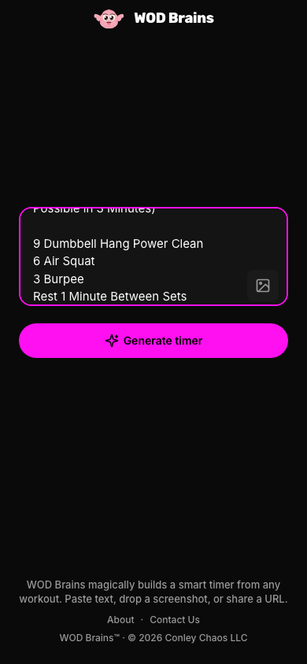
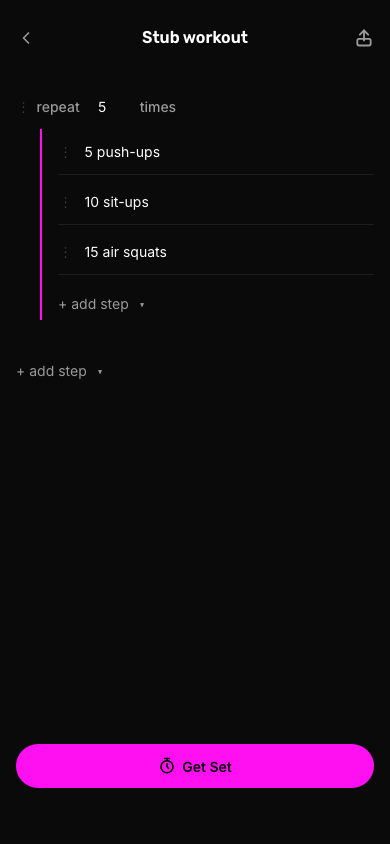

<p align="center">
  
</p>

# WOD Brains

Make smart, beautiful timers from any workout. Paste text, drop a screenshot, or share a URL. Run solo or together in real time.

[Use WOD Brains at https://wodbrains.com](https://wodbrains.com)

## Screenshots

### Import / Create (mobile)



### Review / edit (mobile)



### Run timer (landscape)


## Multiplayer (Leader + Participant)

Leader is authoritative for the run state; participants follow along in sync and can rep-count locally.

- Leader controls start/pause/stop and shares the run link.
- Participant controls are hidden to keep the view clean and read-only.
- Presence and countdown are synchronized for everyone.

| Leader | Participant |
| --- | --- |
|  |  |

## Example workouts to paste

**For time**
```
5 rounds for time:
10 push-ups
15 sit-ups
20 air squats
```

**AMRAP 12**
```
AMRAP 12 minutes:
6 pull-ups
10 push-ups
14 air squats
```

**EMOM**
```
Every 2 minutes for 10 minutes:
12 kettlebell swings
8 box jumps
```

**Intervals**
```
4 rounds
1 min dumbbell power clean
1 min dumbbell squat
1 min lateral burpee over dumbbell
Rest 2 minutes between rounds
```

**From evals (sets-amrap-between-sets-text)**
```
3 Sets
Each Set is a 3 Min AMRAP
(As Many Rounds and Reps As Possible in 3 Minutes)

9 Dumbbell Hang Power Clean
6 Air Squat
3 Burpee
Rest 1 Minute Between Sets
```

## Developing

Developer setup, tests, and deployment steps live in [DEVELOPING.md](DEVELOPING.md).

## License

MIT. Copyright (c) 2026 Conley Chaos LLC. See [LICENSE](LICENSE) and [NOTICE](NOTICE).
